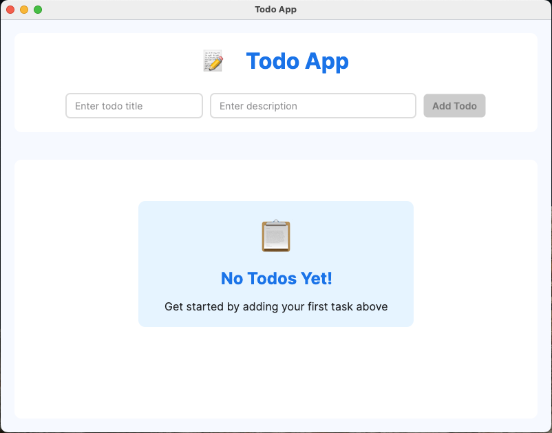
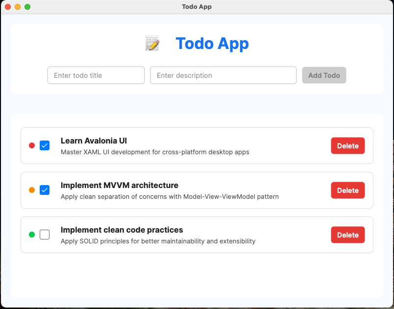

<p align="center">
  
</p>

# Todo App with Avalonia UI

A modern, cross-platform desktop Todo application built with Avalonia UI and C#. Implemented MVVM architecture, SOLID principles, and clean code practices to create a maintainable and well-structured app.

## Screenshots

<p align="center">
  
</p>

<p align="center">
  
</p>

## Features

- Create and delete Todo items
- View color-coded priority indicators
- Mark todos as complete with visual feedback
- Modern UI with card-based design
- Data persistence using in-memory storage
- Cross-platform compatibility (Windows, macOS, Linux)

## Technology Stack

- **UI Framework**: Avalonia UI 11.3.0
- **Language**: C# (.NET 9.0)
- **Architecture**: Model-View-ViewModel (MVVM)
- **Dependency Injection**: Microsoft.Extensions.DependencyInjection

## Architecture Overview

This application follows the MVVM architectural pattern with SOLID principles:

### Models

The `TodoItem` class represents the core data model with properties for title, description, completion status, priority levels, and timestamps.

### ViewModels

- `MainViewModel`: Manages todo operations (add, delete, toggle)
- `ViewModelBase`: Implements property change notification
- Custom converters for UI data binding

### Views

- Modern XAML-based UI with card layout
- Data binding to ViewModels
- Priority visualization with color coding

### Services

- `ITodoService`: Interface following Interface Segregation Principle
- `TodoService`: Implementation with in-memory storage

## Clean Code Principles Applied

- **Single Responsibility Principle**: Each class has a single responsibility
- **Open/Closed Principle**: Code is open for extension but closed for modification
- **Liskov Substitution Principle**: Services can be substituted without breaking functionality
- **Interface Segregation**: Interfaces are client-specific rather than general-purpose
- **Dependency Inversion**: High-level modules depend on abstractions

## How to Run

```bash
# Clone the repository
git clone https://github.com/alishahbaz659/TODO-App-Avalonia.git

# Navigate to the project directory
cd TODO-App-Avalonia

# Build and run the application
dotnet run
```

## License

[Apache License 2.0](LICENSE) 